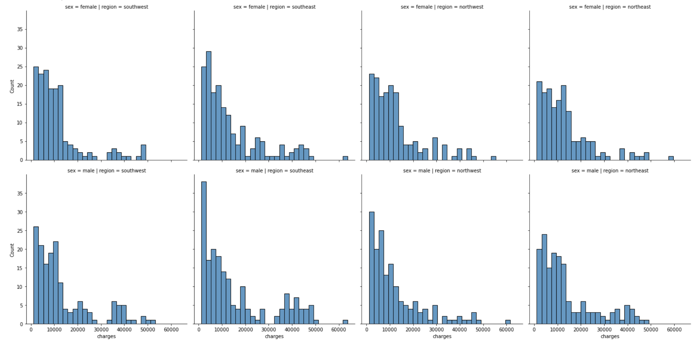

# Final Report

## Introduction:

Universal Healthcare is one of the most valuable privileges we have in Canada that we often pay little mind to. In many other countries individuals seeking medical support often have the added fear of healthcare debt. This is what drew us to conduct our analysis on the medical costs in the privatized medical industry of the United States. We hoped to understand what factors further exacerbated or alleviated the burden of charges and understand these correlations. Conducive to this we focused our attention specifically on health related attributes such as smoker status and bmi then on situational attributes such as sex, region and parental status. 

## Exploratory Data Analysis:

We started our EDA with a simple exploration of the general details, trends and shape of our data to better understand what we had to work with and how we would utilize it to answer our research question.

This provided us with a basic understanding of the dataset by giving us the names of its columns and the type of data in each row

We now had a summary of the important numerical imformation pertinent to answering both our reasearch questions

This figure shows the distribution charges for varying body mass indexes to help grasp a trend

From this we see that there is a higher amount of lower charges for both sexes of non smokers and lower amount but higher charges for both sexes of smokers. We will make the assumptiomn that this is due to the lower population of smokers in society over the whole.

From this plot we see that as the number of children increase the amount of charges actually get lower as opposed to our assumption going into the analysis that it would be the inverse. To understand this we extracted the amount of entries for each amount of children and came to the conclusion that this is due to less people having a greater number of children, providing a smaller sample size. To mitigate this we changed our focus to simply wether the individual was a parent or not. These can all be viewed in our [data analysis for question 2](https://github.com/ubco-W2022T1-cosc301/project-group45/blob/24482e5cb0082479811b7fd7edc6a324238e7a08/notebooks/analysis2.ipynb)

We then wanted to visualize the correlation between sex/region and charges to know where we could begin wrangling our data. This figure showed us some variances but nothing concrete enough to make a connection to charges. This meant we would need to combine the factor of parenthood to get a concrete trend.

Finally we used this pairplot to decide on which factors we would each keep when processing our data for the individual research questions. For the second research question The bmi has no significant correlation to how charges change for a parent/guardian as it would not affect their decision making process of seeking expensive medical attention. However bmi was essential to answering our first research question so we decided to create 2 seperate files of processed data to fit the needs of each question.

## Question 1 + Results:
**What is the correlation between the smoker status of the individual and the monetary value of their medical charge? Also, how does the correlation between smoker status and body mass index further affect the monetary value of the medical insurance charge an individual receives?**

Results of question : 

                                                
     
There are a higher countable amount () of medical insurance charges in the nonsmoker category in comparison to the countable () amount of medical insurance charges in the yes-smoker category which allows us to conclude that individuals who identify as nonsmokers are more prone to receiving a medical insurance charge in comparison to their yes-smoker counterparts. The highest medical insurance charge in the nonsmoker status column was $36910.61, which is $26,859.82 less than the highest medical insurance charge in the yes medical category of $63770.42. This result evidences that individuals who identify as a smoker will be prone to receiving charges of higher monetary value, which is a result that may be caused due to poorer health and subsequently more seruous injuries as a result of their smoking habits. I chose to utilize a Boxplot to display the correlation between the smoker status (in this specific graph comparing yes and no status) and the monetary value of the medical insurance charge. The boxplot further evidences this relationship as it shows that there are a higher amount of medical charges in the nonsmoker category but lesser monetary value amount in comparison to the positive smoker status category. 
 

The above area plot details the varying correlation between the comparison of the two categorical variables BMI > 25 (the BMI was set to analyze only those above 25 as they have an assumable propensity to experience an increase in health issues) and 'Yes' smoker status against the numerical variable of the monetary value of medical insurance charge. The variable kept constant in the area plot is the 'yes' smoker status and this allows us a basis to see how the value of the medical insurance charge fluctuates as the BMI of the individual changes across the collected data. Through observation of the peaks within the area plot it is  evident that the individuals with higher BMI's (peaks in the orange area) are positively correlated with the higher monetary value of insurance charge (peaks in the green area).It is also observable that when the BMI falls closer to a normal of BMI=25,meaning lesser propensity for obesity and subsequent health issues the monetary value of the medical insurance charge decreases immensely.

The above histogram subplot is another great visualization of the fluctuation between varying BMI and monetary value of medical insurance charge. The histogram subplot is a valuable way to quantify the amount of observations that fall into each subplot bin.This allows for the analysis of the bin counts in a columnar form and from there we are able to grasp an immediate and intuitive description of the distribution of medical charges and BMI >25 against the dependent categorical varia By visualizing these binned counts in a columnar fashion, we can obtain a very immediate and intuitive sense of the distribution of values within a variable.

## Question 2 + Results:

**What is the correlation between the number of children or dependants and the amount of charges? Furthermore, how are these trends affected by factors such as sex and/or region?**

After wrangling my data I was able to create this bar chart that shows the average charges for male and females seperated by each 4 regions southeast, northeast, southwest and northwest. From my EDA which you can access in my [data analysis](https://github.com/ubco-W2022T1-cosc301/project-group45/blob/24482e5cb0082479811b7fd7edc6a324238e7a08/notebooks/analysis2.ipynb) I realized that average charges express a more relevant answer to my question as there are different sample sizes for each region as opposed to using a sum of all charges by region. This analysis does show that regardless of being seperated by region, on average males have higher medical costs than females

I then included the factor of parental status to conclude on the exact trends of the medical data. I noticed that Males have similar costs in the northeast and south west regions regardless of parental status but male parents have significant jumps in charges in the northwest and southeast regions. Females however have relatively similar costs regardless of status as a parent with an exception to the Northeast which has a significant jump in cost. The situation of Females in the northeast seem to be an anomaly and thus are ignored in determining my conclusion.

Finally with the above Tableau table you can easily see how the numbers differ across all 16 subgroups. the data shows us that contrary to my assumptions parental status does not have a significant or absolute impact on the number of medical cost charges for an Individual in the United States. When looking at how charges are affected by the number of children each individual cares for, we found no pattern to assert an increase due to more children. Consequently, Male medical costs on average tend to be higher than female medical costs regardless of whether an individual is a parent or not. Furthermore, in half of the regions (northwest & southeast), we see a significant increase in costs for males with children versus males that don't have children. This draws me to conclude that sex and region can indeed have an influence on medical charges for parents but only in very nuanced cases.

## Summary/Conclusion:

In conclusion the evalutaion of this rich dataset informs us that there is a positive correlation between the monetary value of a medical insurance charge but there is not a positive correlation between the amount of charges as a result of positive or negative smoker status. The results also show a positive correlation between BMI and monetary value of the charge as there was an evident fluctuation depending on whether the individual had a high BMI, then they would have a higher charge value and if they had a lower BMI, they would have a lower charge value. Furthermore, it is also evident that the average male will have a higher propensity to be charged with higher medical insurance amount in comparison to their female counterparts and this propensity is unaffected by not only region, but also will be unaffected by their parental status.
